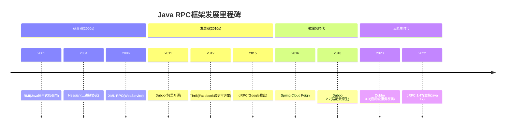
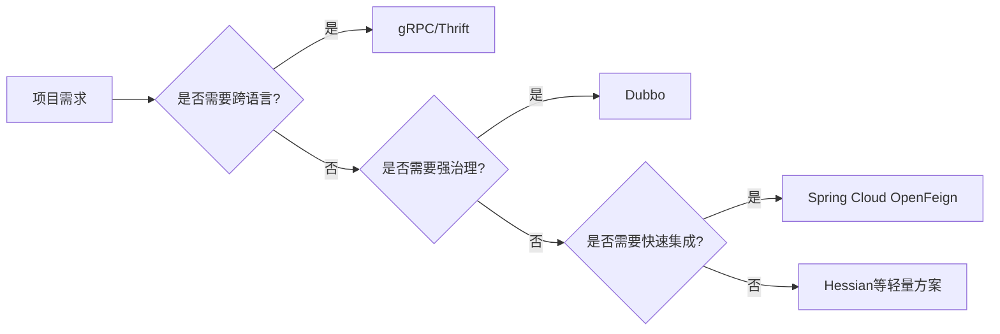
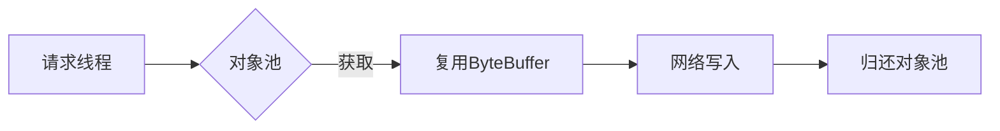
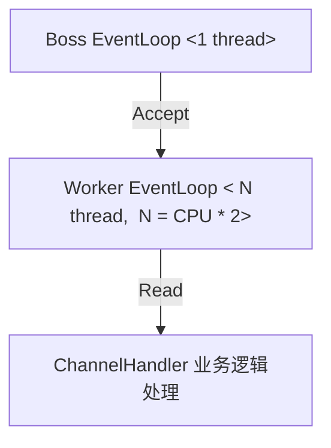
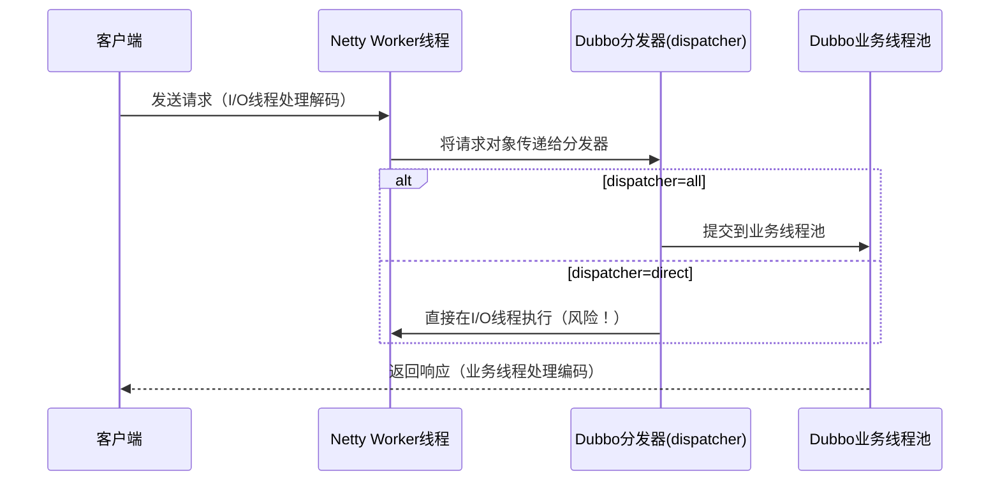

主流框架能力矩阵

| 框架          | 协议支持            | 性能(QPS) | 跨语言 | 服务治理         | 典型应用场景       |
|-------------|-------------------|---------|------|--------------|----------------|
| Dubbo       | Dubbo/Triple/gRPC | 35万+   | 部分   | 完整(限流/熔断)  | 电商交易系统       |
| gRPC        | HTTP/2 + Protobuf | 50万+   | 全支持 | 依赖sidecar    | 物联网数据采集     |
| Thrift      | Thrift Binary     | 28万+   | 全支持 | 无原生支持       | 跨语言数据交换     |
| Spring Cloud| HTTP/JSON         | 8万+    | 有限   | Hystrix集成    | 传统微服务改造     |
| Hessian     | Hessian2 Binary   | 15万+   | 部分   | 需扩展实现       | 遗留系统集成       |

| 场景                   | Dubbo 3.2 | gRPC 1.54 | 优势幅度 |
|------------------------|-----------|-----------|----------|
| 1MB订单对象序列化      | 4.2ms     | 6.8ms     | +38%     |
| 并发10万连接内存       | 2.1GB     | 4.3GB     | +51%     |
| 长连接保活开销         | 0.3% CPU  | 1.2% CPU  | 4倍优势  |

#### Netty VS. Tomcat
| 维度           | Tomcat (NIO模式)         | Netty (Reactor模型)       |
|----------------|--------------------------|---------------------------|
| 线程类型       | 阻塞式请求处理线程池     | 非阻塞EventLoop线程组     |
| 默认线程数     | 200 (maxThreads)         | CPU核心数 × 2             |
| 线程增长策略   | 按需创建直至maxThreads   | 固定大小                  |
| 单线程承载量   | 约1-2k QPS/线程          | 约5-10k QPS/线程          |

性能对比数据 某压测案例（4核8G环境）：

| 指标         | Tomcat 200线程 | Netty 8线程 |
|--------------|----------------|-------------|
| 最大连接数   | 5,000          | 50,000      |
| 吞吐量(QPS)  | 12,000         | 68,000      |
| 内存占用     | 1.2GB          | 480MB       |
| 95\%延迟     | 45ms           | 18ms        |

Netty理想线程数 = CPU可用核心数 × (1 + 平均I/O等待时间比例)
例如：4核CPU，I/O密集型应用（等待时间占比50%）
推荐线程数 = 4 × (1 + 0.5) = 6

Netty以更少线程实现更高性能的核心原因在于其非阻塞式事件驱动架构与高效的线程模型设计
#### 线程模型本质差异
| 特性           | Tomcat线程模型（阻塞式）                          | Netty线程模型（非阻塞式）                      |
|----------------|--------------------------------------------------|-----------------------------------------------|
| 线程工作方式   | 每个线程全程独占式处理请求（连接→读→处理→写）    | 线程仅触发事件回调，I/O操作完全异步            |
| 线程阻塞点     | 在读取请求体、业务逻辑执行、网络响应时都会阻塞    | 仅在执行同步代码时占用线程（约95\%时间线程可复用） |
| 内存消耗       | 每个线程需要独立的栈内存（通常1MB/线程）         | 共享的EventLoop线程，内存占用与连接数无关     |
| 上下文切换成本 | 高（200线程在高并发时频繁切换）                  | 极低（16线程可承载数万连接）                  |

> 案例：处理10k并发请求时，Tomcat需要约200个线程（约200MB栈内存），而Netty仅需8个EventLoop线程（约8MB内存）。

事件驱动机制解析
Netty的Reactor模式三层处理流水线：

连接接入阶段：Boss线程仅处理TCP握手，耗时约3μs（微秒级）
I/O就绪阶段：Worker线程通过epoll检测就绪的Channel（零拷贝）
业务处理阶段：用户代码在ChannelHandler中执行，若包含阻塞操作会破坏模型

