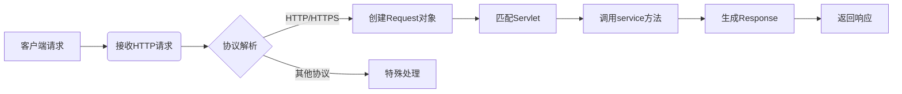
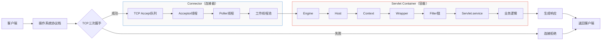
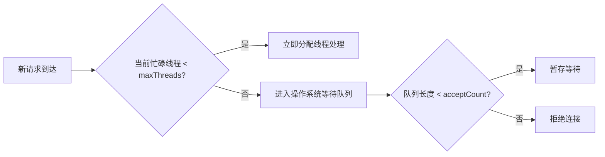
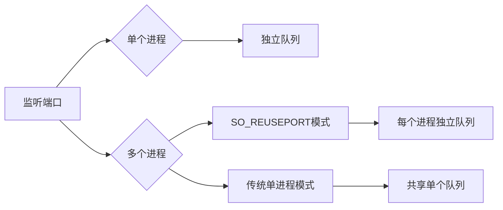
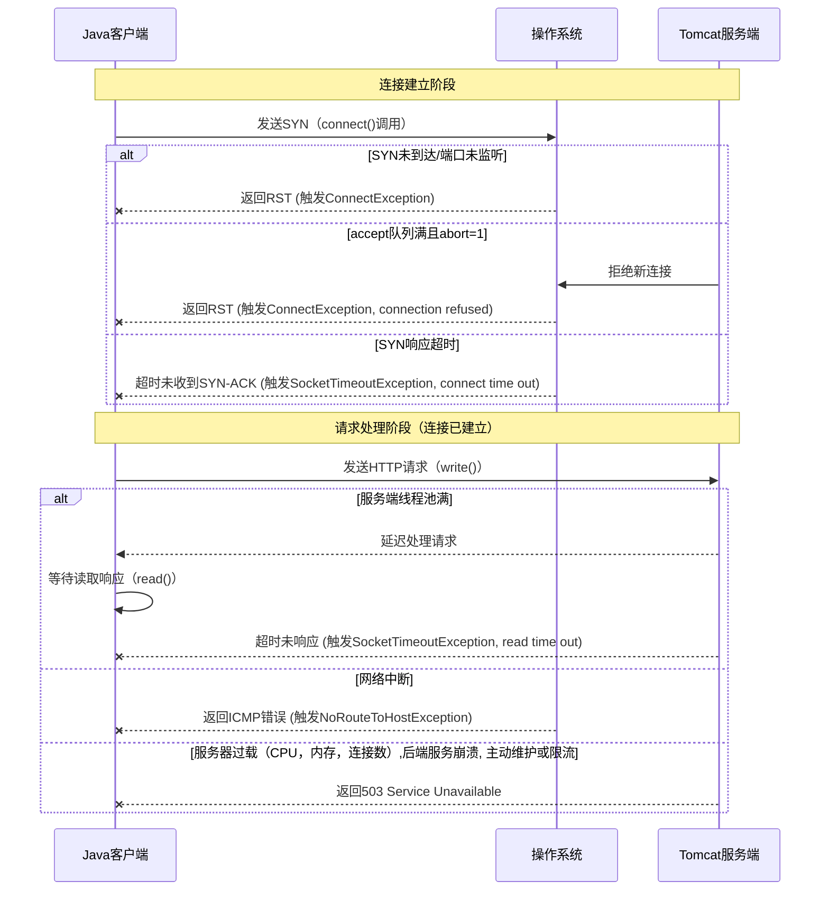

Java Web Container(or Servlet Container)

### Web Container

```mermaid
graph LR
    A[客户端请求] --> B(接收HTTP请求)
    B --> C{协议解析}
    C --> |HTTP/HTTPS| D[创建Request对象]
    C --> |其他协议| E[特殊处理]
    D --> F[匹配Servlet]
    F --> G[调用service方法]
    G --> H[生成Response]
    H --> I[返回响应]
```
#### TCP请求完整链路
> 客户端 → 操作系统协议栈 → TCP队列 → 容器线程池 → Servlet → Filter链 → 业务逻辑

```mermaid
graph LR
    A[客户端] --> B[操作系统协议栈]
    B --> C{TCP三次握手}
    C --> |成功| D[TCP Accept队列]
    C --> |失败| X[连接拒绝]
    
    subgraph Tomcat_Connector ["Connector（连接器）"]
        D --> E[Acceptor线程]
        E --> F[Poller线程]
        F --> G[工作线程池]
    end
    
    subgraph Tomcat_Container ["Servlet Container（容器）"]
        G --> H[Engine]
        H --> I[Host]
        I --> J[Context]
        J --> K[Wrapper]
        K --> L[Filter链]
        L --> M[Servlet.service]
        M --> N[业务逻辑]
    end
    
    N --> O[生成响应]
    O --> P[返回客户端]
    
    X --> P

    style Tomcat_Connector fill:#f9f9f9,stroke:#4a90d6
    style Tomcat_Container fill:#f9f9f9,stroke:#e74c3c
```

### Tomcat

```mermaid
graph LR
A[新请求到达] --> B{当前忙碌线程 < maxThreads?}
B -->|是| C[立即分配线程处理]
B -->|否| D[进入操作系统等待队列]
D --> E{队列长度 < acceptCount?}
E -->|是| F[暂存等待]
E -->|否| G[拒绝连接]
```

#### TCP等待队列（acceptCount）

```mermaid
graph LR
    A[监听端口] --> B{单个进程}
    A --> C{多个进程}
    B --> D[独立队列]
    C --> E[SO_REUSEPORT模式]
    E --> F[每个进程独立队列]
    C --> G[传统单进程模式]
    G --> H[共享单个队列]

```

#### 连接异常

```mermaid
sequenceDiagram
    participant Client as Java客户端
    participant OS as 操作系统
    participant Server as Tomcat服务端

    Note over Client,Server: 连接建立阶段
    Client->>OS: 发送SYN（connect()调用）
    alt SYN未到达/端口未监听
        OS--xClient: 返回RST (触发ConnectException)
    else accept队列满且abort=1
        Server->>OS: 拒绝新连接
        OS--xClient: 返回RST (触发ConnectException, connection refused)
    else SYN响应超时
        OS--xClient: 超时未收到SYN-ACK (触发SocketTimeoutException, connect time out)
    end

    Note over Client,Server: 请求处理阶段（连接已建立）
    Client->>Server: 发送HTTP请求（write()）
    alt 服务端线程池满
        Server-->>Client: 延迟处理请求
        Client->>Client: 等待读取响应（read()）
        Server--xClient: 超时未响应 (触发SocketTimeoutException, read time out)
    else 网络中断
        OS--xClient: 返回ICMP错误 (触发NoRouteToHostException)
    else 服务器过载（CPU，内存，连接数）,后端服务崩溃, 主动维护或限流
        Server--xClient: 返回503 Service Unavailable
    end
```